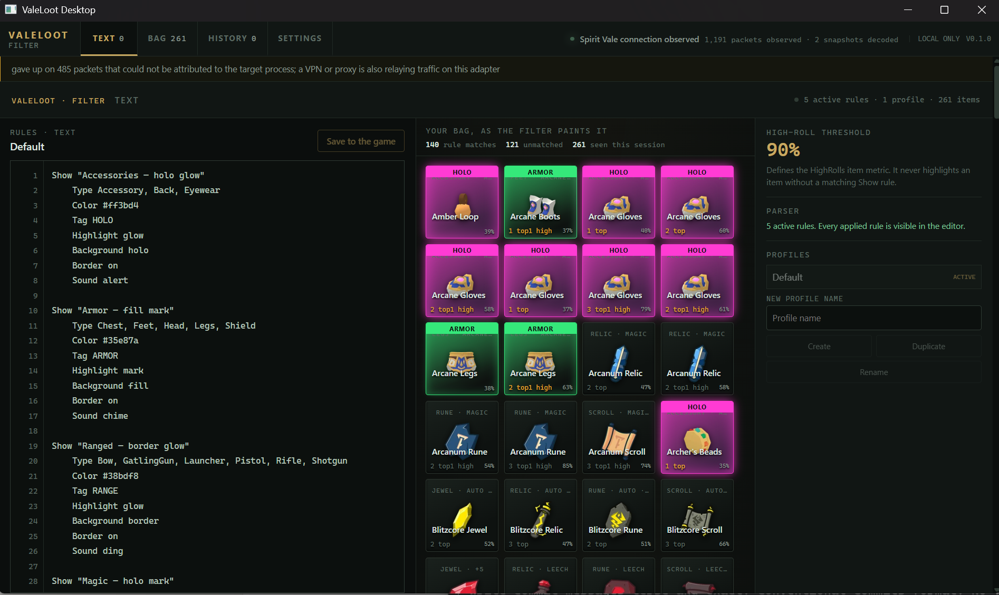

# ValeLoot Desktop

ValeLoot Desktop is a Windows x64 desktop loot ledger for **Spirit Vale**. It
passively observes the game's inventory traffic through Npcap, applies local
ValeLoot rules, and plays local alert sounds for new matching drops.



## Install and run

### Requirements

- Windows 10 or 11, x64
- [Npcap](https://npcap.com/#download), installed separately
- Spirit Vale

Npcap is required for capture and is **not** bundled in ValeLoot Desktop.
Install it before launching ValeLoot. If Npcap is unavailable, ValeLoot can
still open its ledger and settings but cannot observe inventory traffic.

1. Download the Windows ZIP from the [latest release](https://github.com/bjb2/valeloot-desktop/releases/latest).
2. Extract the entire archive to a folder you intend to keep.
3. Run `valeloot-desktop-win_x64.exe`.

Keep the executable, `resources.neu`, `neutralino.config.json`, and
`extensions` directory together. The app keeps its local settings and profiles
in its data directory. Alert history is kept only for the current app session.

Start ValeLoot before starting Spirit Vale when possible, so capture observes
the session setup as well as inventory updates.

Custom alert sounds are loaded from the folder shown under **Settings →
Available sounds**. Drop a `.wav` file there; it appears automatically without
a restart. Reference it as `Sound filename` or `Sound filename.wav`. Filenames
may use letters, numbers, dots, underscores, and hyphens; built-in names remain
reserved.

## Privacy and game boundary

ValeLoot is a passive, local-only companion:

- It observes packets through the installed Npcap driver and never writes
  packets or sends game traffic.
- It decodes only the inventory information needed for the local ledger and
  rule alerts; it does not retain raw packets.
- It does not upload captured data, account identifiers, character details,
  installation paths, or inventory data. Its backend binds only to
  `127.0.0.1`.
- It does not use BepInEx, injection, game-memory access, automation, or game
  file modification.

The app deliberately does **not** recolor in-game item cells or add in-game
tooltips. ValeLoot's rule colors and inspection live in its own desktop ledger,
leaving the Spirit Vale client untouched.

## Build from source

Use a clean Windows x64 checkout with Bun 1.4 or newer and Npcap installed:

```powershell
bun run setup
bun run check
bun run package
```

`setup` installs the pinned Bun dependencies and downloads/updates the
Neutralino binaries. `check` runs the TypeScript checks and test suite.
`package` prepares the browser frontend and Bun backend, produces the
Neutralino Windows release layout, verifies that its expected outputs are
current, and writes:

```text
dist/ValeLoot-Desktop-v<version>-windows-x64.zip
```

The release packager refuses missing, mismatched, or stale release outputs;
it does not emit a partial archive.

### Useful commands

```text
bun run dev       Prepare, build, and launch a development window
bun run build     Prepare the frontend/backend and build Neutralino
bun run check     Run TypeScript checks and tests
bun run package   Build and package the Windows x64 release ZIP
```

Generated `resources/`, `extensions/`, `dist/`, and installed dependencies are
ignored by Git.

## Licensing and source

ValeLoot Desktop is licensed under the GNU Affero General Public License,
version 3 or later. See [LICENSE](LICENSE) and [NOTICE](NOTICE). Each release
archive includes a `source/` directory containing the corresponding ValeLoot
Desktop source, exact dependency manifest and lockfile, configuration, and
build scripts; see [SOURCE-OFFER.txt](SOURCE-OFFER.txt). Npcap is a separately
licensed dependency and is not included.
